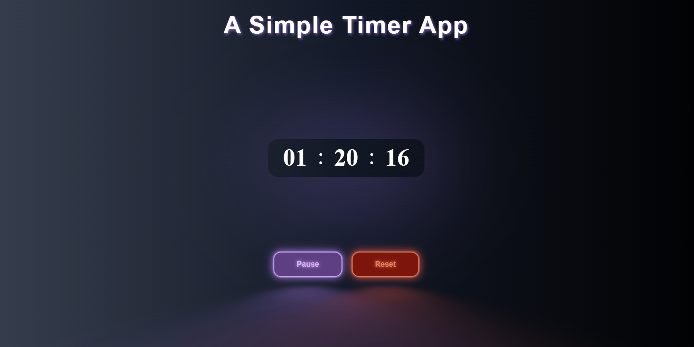

# Timer App ⏳

A simple timer application built with React and Vite. This app allows users to set a timer using hours, minutes, and seconds, with features to start, pause, reset, and display the remaining time. As the name shows this is a Practice Project, 3rd Practice Project.

## Features 🌟
- ⏰ Set hours, minutes, and seconds for the timer.
- ▶️ Start the timer and see it count down.
- ⏸️ Pause and resume the timer.
- 🔄 Reset the timer to zero.

## Technologies Used 🛠️

## Preview 👀

  
  

